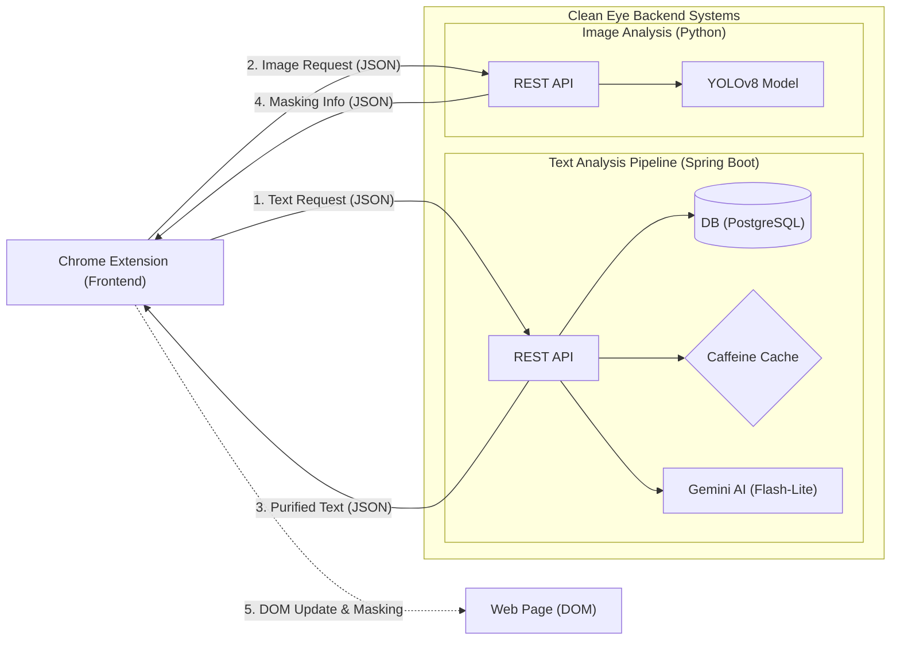
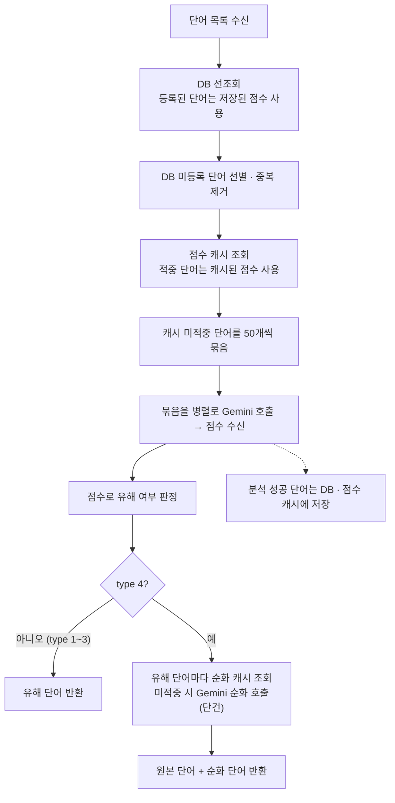

# 👁️ Clean Eye: 실시간 AI 텍스트 필터링 엔진

## 🌟 프로젝트 소개
**Clean Eye**는 저연령층 사용자가 웹 서핑 중 직면하는 유해 콘텐츠(비속어, 선정적 이미지 등) 노출 문제를 해결하기 위한 **AI 기반 실시간 콘텐츠 필터링 시스템**입니다.

단순히 사전에 등록된 단어를 가리는 방식에서 벗어나, 유튜브 홈 화면 수준의 대량 데이터(300~400단어)를 실시간으로 분석합니다. Chrome 확장 프로그램 형태로 제공되어 사용자가 인지하지 못할 만큼 빠른 속도(캐시 적중 시 **131ms**)로 쾌적하고 안전한 인터넷 환경을 구축합니다.

| 항목 | 내용 |
| :--- | :--- |
| **개발 기간** | 2025-03 ~ 2025-06 (캡스톤디자인, 4인 팀) · 캡스톤 종료 후 서버 개선 지속 |
| **담당 범위** | 텍스트 분석 서버의 설계·구현 및 성능 최적화 (Spring Boot, Gemini API) |

---

## 🚀 주요 기능

### 🤖 AI 기반 고성능 실시간 필터링
* **Text Analysis:** Google Gemini AI를 활용해 단순 키워드 매칭이 아닌 AI 기반의 유해성 판별 및 표현 순화 기능을 제공합니다. 확장 프로그램이 화면에서 추출한 텍스트 조각(25자 이하)을 조각 단위로 유해성 점수화합니다.
* **Image Detection:** YOLOv8 모델을 사용하여 웹페이지 내 이미지를 실시간 스캔하고 유해 요소를 탐지합니다.

### 🌐 크롬 확장 프로그램 최적화
* 별도의 앱 설치 없이 브라우저에서 즉시 구동되며, 웹페이지의 DOM에 직접 접근하여 콘텐츠를 실시간으로 제어합니다.

### ⚡ 하이브리드 최적화 아키텍처
* 1차 DB/캐시 선조회와 2차 AI 분석을 결합하여 응답 속도와 AI 호출량을 줄이도록 설계했습니다.

### 🔧 사용자 맞춤형 필터링 설정
* 사용자가 직접 필터링 강도를 조절하여 개개인의 환경에 최적화된 필터링 수준을 설정할 수 있습니다.

---

## 🏗 시스템 아키텍처
Clean Eye는 클라이언트와 서버 간의 비동기 통신을 통해 실시간 필터링을 수행합니다.

1. **콘텐츠 추출 (Client):** 사용자가 웹페이지 접속 시, 확장 프로그램이 페이지 내 모든 텍스트와 이미지 URL을 수집합니다.
2. **API 요청 (Client → Server):** 추출된 데이터를 REST API를 통해 텍스트 서버(Spring Boot)와 이미지 서버(Python)로 전송합니다.
3. **계층형 콘텐츠 분석 (Server):**
   * **Text Server:** **[DB 조회] → [메모리 캐시] → [병렬 배치 AI 분석] → [결과 영속화]**의 4단계 계층 구조를 통해, 이미 분석한 단어는 DB·캐시에서 바로, 새 단어는 병렬 배치 AI 분석으로 판별하고 그 결과를 DB에 저장합니다. type 4(AI 표현)는 판별 뒤 유해 단어에 대해서만 순화를 추가로 요청합니다.
   * **Image Server:** YOLOv8 모델을 통해 전송된 이미지의 유해성을 실시간으로 분석합니다.
4. **결과 반환 및 필터링 (Server → Client):** 분석 결과를 바탕으로 클라이언트가 웹페이지의 HTML 코드를 직접 수정하여 유해 콘텐츠를 가리거나 순화된 텍스트로 대체합니다.


---

## 🎯 My Key Contributions (유찬영)
텍스트 분석 서버의 아키텍처 설계와 성능 고도화를 전담해, 외부 API의 제약 속에서도 실시간 서비스가 가능한 응답 속도와 호출량을 만드는 데 집중했습니다.

* **응답 속도:** 배칭과 병렬 처리로 응답 지연을 13.9초에서 1.4초로 단축 (같은 입력 기준)
* **API 호출량:** 유해성 점수 분석의 호출 횟수를 98% 절감 (400회 → 8회)
* **분석 결과 영속화 및 재사용:** 분석한 단어를 DB에 저장해 같은 단어의 AI 재호출을 막는 구조

---

## 🧠 성능 최적화 Deep Dive

### **Challenge: 대규모 데이터 처리 시 시스템 블랙아웃**
유튜브 홈 화면과 같은 대량의 텍스트(300~400단어) 분석 시, 단어마다 Gemini를 개별 호출하는 초기 방식은 **13.9초 이상의 응답 지연**과 **429(Too Many Requests) 에러**를 발생시켜 서비스가 사실상 불가능한 상태였습니다.

### **Solution: 4단계 최적화**

1. **배칭(Batching):** 400개의 개별 요청을 **50개 단위 청크**로 통합해 호출을 400회에서 8회로 줄였습니다(98% 감소). 유해성 점수 분석 구간에 적용했으며 모든 type(1~4)에서 동일합니다.
2. **병렬 처리(Parallel Processing):** `CompletableFuture`로 분할된 배치 요청을 동시에 호출하고 응답을 하나로 취합합니다. 배칭과 함께 적용해 응답 속도가 **13.9s → 1.4s**로 단축되고, 같은 입력 기준 429 에러 없이 처리되었습니다. 이 수치는 순화를 하지 않는 type 1~3(별표·취소선·블러) 기준입니다.
3. **API 재호출 방지(Caching):** DB 뒤에서 "아직 DB에 없는 단어"의 Gemini 재호출을 막는 **Caffeine Cache**입니다. 점수 캐시는 분석 결과가 DB에 반영되기 전 구간의 중복 호출을, 순화 캐시(type 4)는 DB에 저장하지 않는 순화 결과의 반복 호출을 줄입니다. 캐시 적중 시 **131ms**대로 응답합니다.
4. **분석 결과 영속화 및 재사용:** AI 분석 결과를 DB에 저장해, 같은 단어는 다음 요청부터 DB에서 바로 응답하고 AI를 호출하지 않습니다. 분석한 단어가 쌓일수록 AI 호출이 줄어드는 구조입니다.

### **요청 처리 흐름**



### **📊 개선 지표 (300~400단어 기준)**
| 단계 | 적용 기술 | 응답 속도 (Latency) | 비고 |
| :--- | :--- | :--- | :--- |
| **Step 0** | 단어별 개별 호출 모델 | **13.9s+** | 서비스 불능 (429 Error) |
| **Step 1** | **Batching (n=50) + 병렬 처리** | **1.4s** | 점수 분석 호출 400회 → 8회 (98% 감소) |
| **Step 2** | **Caffeine Caching** | **131ms** | 캐시 적중 시 (반복 단어는 AI 호출 생략) |
| **Step 3** | **결과 영속화 및 재사용** | - | 분석한 단어는 DB에서 바로 응답 (AI 호출 생략) |

### **측정 조건**
| 항목 | 내용 |
| :--- | :--- |
| 비교 환경 | 13.9초와 1.4초는 동일한 Gemini 모델, AWS EC2(무료 인스턴스) 환경에서 측정 |
| 적용한 개선 | 1.4초는 배칭과 병렬 처리를 함께 적용한 결과 |
| 캐시 조건 | 131ms는 DB에 없고 점수 캐시에 저장된 단어를 처리한 경우 |
| 측정 횟수 | 각 수치는 단일 측정 |

캡스톤 당시 단건 호출 구현에서는 단어별 Gemini 호출 시간과 응답 파싱 시간을 `[PERF]` 로그로 기록했습니다. 현재 서버는 요청 단위로 `[분석 완료] 최종 소요 시간` 로그에 소요 시간과 DB·캐시·AI 처리 건수를 함께 기록합니다.

> **참고 (type 4: AI 표현):** 유해성 판별은 type 1~3과 같은 배치 경로를 사용하고, 판별된 유해 단어에 대해서만 순화를 추가로 요청합니다. 순화는 단어 단위로 호출하며 Caffeine 캐시(`refinedTextResults`)로 반복 호출만 줄입니다. 순화 구간에는 배칭·병렬 처리를 적용하지 않았습니다.

---

## 📡 API 명세

### 엔드포인트
| 메서드 | 경로 | 설명 |
| :--- | :--- | :--- |
| POST | `/api/text/analyze` | 텍스트 목록 유해성 분석 (type 4는 순화 포함) |
| POST | `/api/text/report` | 유해 단어 수동 신고 (`text`, `score` 쿼리 파라미터, `score` 기본값 100) |
| GET | `/api/text/health` | 서버 상태 확인 |

### 요청 (`POST /api/text/analyze`)
| 필드 | 필수 | 제한 | 설명 |
| :--- | :--- | :--- | :--- |
| `words` | 필수 | 1개 이상 | 분석할 텍스트 목록 |
| `rate` | 필수 | 0~100 | 필터링 강도. 높을수록 낮은 점수도 유해로 판정 (유해 판정 임계값 = 101 − `rate`) |
| `type` | 필수 | 1~4 | 1~3: 마스킹 방식(별표·취소선·블러), 4: AI 순화 |
| `requestUrl` | 선택 | - | 분석 대상 페이지 URL. 응답에 그대로 돌려줌 |

확장 프로그램은 화면에 보이는 텍스트를 줄바꿈·탭·괄호·하이픈 기준으로 잘라, 숫자만 있는 조각과 25자를 넘는 조각을 제외한 텍스트 조각 목록을 `words`로 보냅니다. 서버는 조각마다 따로 유해성 점수를 매깁니다.

```json
{
  "words": ["오늘 날씨가 좋네요", "죽어버려"],
  "rate": 80,
  "type": 4,
  "requestUrl": "https://example.com/article"
}
```

### 응답 (200 OK)
유해로 판정된 단어만 `words`에 담깁니다.

| type | 응답 필드 |
| :--- | :--- |
| 1~3 (별표·취소선·블러) | `words`(유해 단어), `requestUrl`, `type` |
| 4 (AI 표현) | `words`(원본 유해 단어), `refinedWords`(순화 단어), `requestUrl`, `type` |

```json
{
  "words": ["죽어버려"],
  "refinedWords": ["순화된 표현"],
  "requestUrl": "https://example.com/article",
  "type": 4
}
```

프론트엔드가 요청과 결과를 쉽게 맞춰 볼 수 있도록 응답에 `requestUrl`과 `type`을 포함했고, type 4는 원본 단어와 순화 단어를 함께 내려줍니다. API 명세와 더미 데이터를 공유해 프론트엔드가 서버 완성을 기다리지 않고 출력 처리를 진행할 수 있었습니다.

### 오류 응답
필수 필드가 없거나 `rate`·`type`이 허용 범위를 벗어나면 `400 Bad Request`를 반환합니다.

---

## 🧪 테스트와 실패 처리

### 테스트
테스트는 인메모리 H2 DB로 실행되어 PostgreSQL 없이 돌아갑니다.

```bash
./gradlew test
```

* **분석 흐름:** DB에 등록된 단어는 Gemini를 호출하지 않고 DB 점수를 사용하며 신고 횟수를 올린다 / 캐시에 점수가 있는 단어는 Gemini를 다시 호출하지 않는다 / 캐시 미스 단어는 Gemini 배치로 분석한 뒤 DB에 저장하고 캐시에 적재해 다음 요청에서는 재호출하지 않는다
* **배칭:** 캐시 미스 단어는 50개 단위 청크로 나눠 호출한다 / 같은 요청 안의 중복 단어는 한 번만 보낸다
* **필터링 강도:** `rate`가 높을수록 임계값이 낮아진다
* **type 4 순화:** 유해로 판정된 단어만 순화를 요청하고, type 4가 아니면 순화를 요청하지 않는다 / 같은 단어의 순화 요청은 두 번째부터 캐시에서 응답한다
* **응답 파싱:** 코드 펜스로 감싼 JSON 배열 응답도 단어별 점수로 파싱한다 / 순화 응답을 정리하고, 원문 그대로이거나 대체어가 없거나 너무 길거나 여러 줄이면 순화불가로 처리한다

### 실패 처리
| 상황 | 처리 |
| :--- | :--- |
| Gemini 호출 실패 (429, 타임아웃 포함) | 해당 묶음을 분석 실패로 처리해 0점을 부여하고, DB·캐시에는 저장하지 않음 |
| 배치 응답 JSON 파싱 실패 | 위와 동일 |
| 순화 호출 실패 또는 부적절한 순화 응답 | `순화불가` 반환 |

분석 실패 결과는 DB·캐시에 저장하지 않아 다음 요청에서 다시 분석합니다.

---

## ⚙️ 서버 실행 방법 (Text Server)

**요구 사항:** Java 17, PostgreSQL

1. **DB 생성:** PostgreSQL에 `cleaneye_test` 데이터베이스를 만듭니다.
   ```sql
   CREATE DATABASE cleaneye_test;
   ```
   접속 정보 기본값은 `localhost:5432`, 계정 `postgres` / `postgres`이며 `src/main/resources/application.properties`에서 바꿀 수 있습니다. 테이블은 서버 시작 시 자동 생성되고(`ddl-auto=update`), `badwords.json`의 기본 유해 단어가 점수 100으로 등록됩니다.
2. **환경변수:** Gemini API 키를 `GEMINI_API_KEY`로 설정합니다.
   ```bash
   export GEMINI_API_KEY=발급받은_키          # Windows PowerShell: $env:GEMINI_API_KEY="발급받은_키"
   ```
3. **빌드 및 실행:**
   ```bash
   ./gradlew build
   ./gradlew bootRun
   ```
   서버는 기본 포트 8080에서 실행되며, `GET /api/text/health`로 동작을 확인할 수 있습니다.

---

## 🗓 개발 기간과 작업 구분

| 시기 | 내용 |
| :--- | :--- |
| **캡스톤디자인 (2025-03 ~ 2025-06)** | 단어별 단건 Gemini 호출, Reactor 병렬 처리, 점수·순화 `@Cacheable`, 수작업 유해 단어 DB, Gemini 2.0 Flash 사용. 서버 구현 커밋 2025-04-29 ~ 05-21, 2025-05-13 로컬·AWS EC2 동작 확인 |
| **캡스톤 종료 후** | 팀원의 요청으로 서버를 AWS에 다시 띄우며 Gemini 2.5 Flash-Lite로 전환. 배칭·`CompletableFuture` 병렬 처리·결과 영속화 구현(GitHub 이력 2026-02-23~). 점수 캐시 연결과 순화 기능 복원(2026-09-23), 단위 테스트 추가(2026-09-28), 분석 실패 결과 미저장과 미사용 단건 호출 경로 정리(2026-09-30) |

---

## 💡 회고 및 배운 점 (Retrospective)

**"비용 투입이 아닌, 설계와 목적에 맞는 기술 선택을 통한 문제 해결"**

429 에러와 응답 지연을 겪으며 서버 스케일아웃이나 API 요금제 업그레이드를 생각했습니다. 하지만 배칭·병렬 처리·캐싱·결과 영속화를 적용하면서, 자원을 늘리기 전에 불필요한 호출과 대기 시간을 줄일 여지가 있다는 것을 배웠습니다. 특히 서버의 처리 능력과 외부 API의 호출 한도는 구분해서 살펴야 하며, 병목이 어디에 있는지에 따라 해결 방법도 달라진다는 점을 알게 됐습니다. 이후에는 성능 문제가 생기면 먼저 요청 흐름과 중복 작업을 확인하고, 그 결과를 바탕으로 자원 증설이나 요금제 변경을 판단하려고 합니다.

---

## 🛠 기술 스택 (Tech Stack)

### **Backend (Text Analysis)**
* **Language & Framework:** Java 17, Spring Boot 3
* **Database:** PostgreSQL
* **Performance:** Caffeine Cache, CompletableFuture (Concurrency)
* **External API:** Google Gemini 2.5 Flash-Lite (캡스톤 당시 Gemini 2.0 Flash 사용, 캡스톤 종료 후 AWS 재배포 시 2.5 Flash-Lite로 전환)

### **Image & Frontend (Team)**
* **Image Analysis:** Python, YOLOv8, OpenCV
* **Client:** JavaScript (Chrome Extension API), HTML/CSS
* **Infrastructure:** AWS EC2

---

## 🎥 시연 영상 및 결과물
* **YouTube:** [Clean Eye 시연 영상 보러가기](https://youtu.be/Xt6dk59f7CY?si=fuph3n8BtF4rQEa9)
* **확인 포인트:**
  * **동적 콘텐츠 분석:** 외부로부터 수신된 웹메일 본문 내 유해 텍스트의 실시간 탐지 및 마스킹 성능
  * **지연 없는 사용자 경험:** 텍스트 데이터가 로드되는 즉시 0.1초대의 속도로 분석 결과가 반영되는 과정 확인
  * **AI 기반 판별:** 메일 내 포함된 비속어 및 우회적 표현에 대한 AI 분석 결과의 정확도

---

## 👥 팀 소개 (Team 코드자판기)
| 역할 | 이름 |
| :--- | :--- |
| **팀장 / 프론트엔드 (통신 및 데이터 처리)** | 김동완 |
| **백엔드 아키텍처 및 성능 최적화 (텍스트)** | **유찬영** |
| **백엔드 (이미지 서버)** | 이경주 |
| **프론트엔드 (UI 및 데이터 추출)** | 이중화 |


### 🤝 Collaboration & Communication
크롬 확장 프로그램(프론트엔드)과 두 개의 독립된 분석 서버(텍스트/이미지 백엔드) 간의 원활한 연동을 위해, 정기적인 대면 및 메신저 회의를 통해 표준화된 JSON API 응답 규격을 정의했습니다. 클라이언트가 텍스트와 이미지 분석 요청을 각 서버로 독립적으로 전송하고 응답받는 직관적인 구조를 설계하여, 불필요한 서버 간 결합도를 낮추고 프론트엔드 렌더링 속도를 확보했습니다.

---

## ⚙️ 사용 방법 (Usage)
1. **설정:** 아이콘 클릭 후 연령대에 맞는 필터링 강도(Threshold)를 설정합니다.
2. **작동:** 접속 시 자동으로 유해 콘텐츠 분석 및 마스킹/순화 처리가 수행됩니다.


