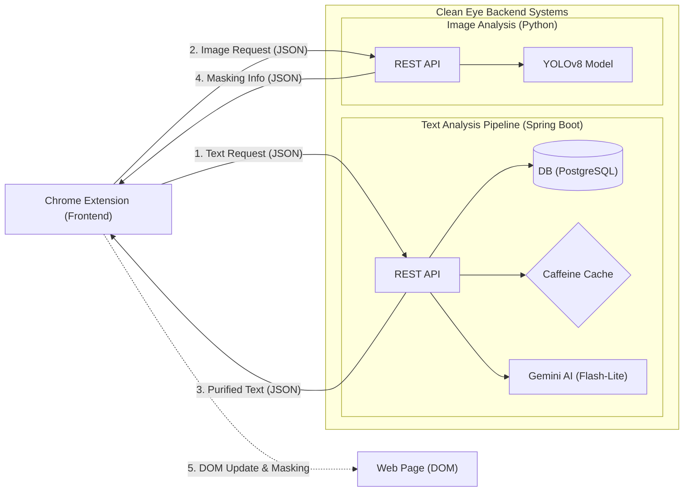
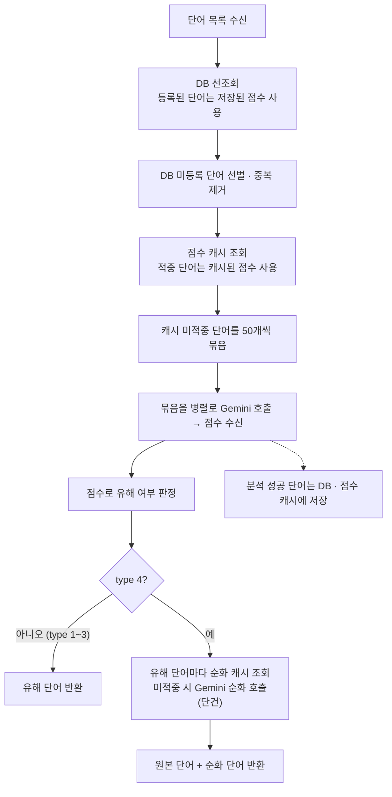

# 👁️ Clean Eye: 실시간 AI 텍스트 필터링 엔진

## 🌟 프로젝트 소개
**Clean Eye**는 저연령층 사용자가 웹 서핑 중 직면하는 유해 콘텐츠(비속어, 선정적 이미지 등) 노출 문제를 해결하기 위한 **AI 기반 실시간 콘텐츠 필터링 시스템**입니다.

단순히 사전에 등록된 단어를 가리는 방식에서 벗어나, 유튜브 홈 화면 수준의 대량 데이터(300~400단어)를 실시간으로 분석합니다. Chrome 확장 프로그램 형태로 제공되어 사용자가 인지하지 못할 만큼 빠른 속도(캐시 적중 시 **131ms**)로 쾌적하고 안전한 인터넷 환경을 구축합니다.

---

## 🚀 주요 기능

### 🤖 AI 기반 고성능 실시간 필터링
* **Text Analysis:** Google Gemini AI를 활용해 단순 키워드 매칭이 아닌 문맥 기반의 유해성 판별 및 표현 순화 기능을 제공합니다.
* **Image Detection:** YOLOv8 모델을 사용하여 웹페이지 내 이미지를 실시간 스캔하고 유해 요소를 탐지합니다.

### 🌐 크롬 확장 프로그램 최적화
* 별도의 앱 설치 없이 브라우저에서 즉시 구동되며, 웹페이지의 DOM에 직접 접근하여 콘텐츠를 실시간으로 제어합니다.

### ⚡ 하이브리드 최적화 아키텍처
* 1차 DB/캐시 선조회와 2차 AI 분석을 결합하여 응답 속도와 AI 호출량을 줄이도록 설계했습니다.

### 🔧 사용자 맞춤형 필터링 설정
* 사용자가 직접 필터링 강도를 조절하여 개개인의 환경에 최적화된 필터링 수준을 설정할 수 있습니다.

---

## 🏗 시스템 아키텍처
Clean Eye는 클라이언트와 서버 간의 비동기 통신을 통해 실시간 필터링을 수행합니다.

1. **콘텐츠 추출 (Client):** 사용자가 웹페이지 접속 시, 확장 프로그램이 페이지 내 모든 텍스트와 이미지 URL을 수집합니다.
2. **API 요청 (Client → Server):** 추출된 데이터를 REST API를 통해 텍스트 서버(Spring Boot)와 이미지 서버(Python)로 전송합니다.
3. **계층형 콘텐츠 분석 (Server):**
   * **Text Server:** **[DB 조회] → [메모리 캐시] → [병렬 배치 AI 분석] → [DB 아카이빙]**의 4단계 계층 구조를 통해, 이미 분석한 단어는 DB·캐시에서 바로, 새 단어는 병렬 배치 AI 분석으로 판별하고 그 결과를 DB에 저장합니다. type 4(AI 표현)는 판별 뒤 유해 단어에 대해서만 순화를 추가로 요청합니다.
   * **Image Server:** YOLOv8 모델을 통해 전송된 이미지의 유해성을 실시간으로 분석합니다.
4. **결과 반환 및 필터링 (Server → Client):** 분석 결과를 바탕으로 클라이언트가 웹페이지의 HTML 코드를 직접 수정하여 유해 콘텐츠를 가리거나 순화된 텍스트로 대체합니다.

---

## 🎯 My Key Contributions (유찬영)
본 프로젝트에서 **텍스트 분석 서버의 아키텍처 설계 및 전체적인 성능 고도화**를 전담하였습니다. 특히 외부 API의 환경적 제약을 기술적 설계로 극복하여 실시간 서비스가 가능한 응답 속도와 호출량을 만드는 데 집중했습니다.

* **성능 병목 해결:** 배칭으로 응답 지연을 13.9초에서 1.4초로 단축(같은 입력 기준), 반복 단어는 캐시 적중 시 131ms
* **비용 및 유량 최적화:** 유해성 점수 분석의 API 호출 횟수를 98% 절감(400회 → 8회)해 운영 비용과 유량 제한 부담을 낮출 수 있는 구조를 만들었습니다
* **데이터 아카이빙 설계:** 자가 성장형 DB 구조를 구축해, 운영 시간이 길어질수록 외부 AI 호출이 줄어들 것으로 기대할 수 있게 했습니다

---

## 🧠 성능 최적화 Deep Dive (13.9s → 1.4s, 캐시 적중 시 131ms)

### **Challenge: 대규모 데이터 처리 시 시스템 블랙아웃**
유튜브 홈 화면과 같은 대량의 텍스트(300~400단어) 분석 시, 단어마다 Gemini를 개별 호출하는 초기 방식은 **13.9초 이상의 응답 지연**과 **429(Too Many Requests) 에러**를 발생시켜 서비스가 사실상 불가능한 상태였습니다.

### **Solution: 4단계 계층형 최적화 아키텍처**
문제를 해결하기 위해 다음과 같이 점진적으로 시스템을 고도화했습니다.

1. **배칭(Batching):** 400개의 개별 요청을 **50개 단위 청크(Chunk)**로 통합해 호출 횟수를 400회에서 8회로 줄였습니다(98% 감소). 그 결과 응답 속도가 **13.9s → 1.4s**로 단축되고, 같은 입력 기준 429 에러 없이 처리되었습니다. 배칭은 유해성 점수 분석 구간에 적용했으며, 모든 type(1~4)에서 동일하게 적용됩니다. 위 수치는 순화를 하지 않는 type 1~3(별표·취소선·블러) 기준입니다.
2. **병렬 처리(Parallel Processing):** `CompletableFuture`로 분할된 배치 요청을 동시에 호출하고, 모든 묶음의 응답을 받아 하나로 취합합니다.
3. **API 재호출 방지(Caching):** DB는 한 번 등록되면 영구히 유지되는 신뢰 소스이고, **Caffeine Cache**는 그 뒤에서 "아직 DB에 없는 단어"의 Gemini 재호출을 막는 계층입니다. 점수 캐시는 분석 결과가 DB에 반영되기 전 구간의 중복 호출을, 순화 캐시(type 4)는 DB에 저장하지 않는 순화 결과의 반복 호출을 줄입니다. 캐시가 적중하면 **131ms**대의 응답 속도를 유지합니다.
4. **데이터 아카이빙(Archiving):** AI 분석 결과를 실시간 DB에 영속화하는 자가 학습 구조를 설계하여, 운영 시간이 길어질수록 API 호출이 줄어드는 선순환 구조를 설계했습니다.

### **요청 처리 흐름**

### **📊 최종 개선 지표 (300~400단어 기준)**
| 단계 | 적용 기술 | 응답 속도 (Latency) | 비고 |
| :--- | :--- | :--- | :--- |
| **Step 0** | 단어별 개별 호출 모델 | **13.9s+** | 서비스 불능 (429 Error) |
| **Step 1** | **Batching (n=50)** | **1.4s** | 점수 분석 호출 400회 → 8회 (98% 감소) |
| **Step 2** | **Caffeine Caching** | **131ms** | 캐시 적중 시 (반복 단어는 AI 호출 생략) |
| **Step 3** | **Data Archiving** | **운영 시간에 따라 AI 호출 감소 기대** | 자가 성장형 구조 |

> **참고 (type 4: AI 표현):** 유해성 판별은 type 1~3과 같은 배치 경로를 사용하고, 판별된 유해 단어에 대해서만 순화를 추가로 요청합니다. 순화는 단어 단위로 호출하며 Caffeine 캐시(`refinedTextResults`)로 반복 호출만 줄입니다. 순화 구간에는 배칭·병렬 처리를 적용하지 않았습니다.

### **API 응답 형식**
| type | 응답 필드 |
| :--- | :--- |
| 1~3 (별표·취소선·블러) | `words`(유해 단어), `requestUrl`, `type` |
| 4 (AI 표현) | `words`(원본 유해 단어), `refinedWords`(순화 단어), `requestUrl`, `type` |

프론트엔드가 요청과 결과를 쉽게 맞춰 볼 수 있도록 응답에 `requestUrl`과 `type`을 포함했고, type 4는 원본 단어와 순화 단어를 함께 내려줍니다. API 명세와 더미 데이터를 공유해 프론트엔드가 서버 완성을 기다리지 않고 출력 처리를 진행할 수 있었습니다.

---

## 💡 회고 및 배운 점 (Retrospective)

**"비용 투입(과금)이 아닌, 아키텍처 설계와 목적에 맞는 기술 선택을 통한 문제 해결"**

대량의 API 요청으로 인한 지연 및 429 에러 문제를 직면했을 때, 단순히 고비용의 AWS 서버로 스케일업(Scale-up)하거나 API 요금제를 업그레이드하는 쉬운 방법 대신 '소프트웨어 설계'로 문제를 해결하고자 했습니다. 

쿼리를 최적화하고 배칭(Batching)과 로컬 캐싱(Caching)을 도입함으로써 외부 API 호출 자체를 대폭 줄여 외부 의존도를 낮췄습니다. 또한 무조건 무겁고 성능이 좋은 최신 AI 모델을 맹목적으로 고집하기보다, '텍스트 필터링 및 단어 순화'라는 서비스 목적에 가장 부합하면서도 응답이 빠른 경량화 모델(Gemini Flash-Lite)을 취사선택했습니다. 

이를 통해 응답 속도와 호출량을 낮추면서 운영 비용 부담도 줄일 수 있는 구조를 만들었고, 주어진 제약 환경을 논리적인 엔지니어링 역량으로 극복해 내는 것이 백엔드 개발자의 진정한 역할임을 깨달았습니다.

추가로, AI 코드 리뷰로 README 설명과 실제 코드가 어긋난 부분(호출되지 않던 캐시 메서드, 입력을 그대로 돌려주던 순화 기능)을 발견했고, 이를 그대로 반영하지 않고 캡스톤 전시회 버전 코드와 직접 대조해 원래 설계(DB 선조회 후 캐시 조회)를 확인한 뒤 복원했습니다. 복원한 동작은 단위 테스트로 검증했습니다.

---

## 🛠 기술 스택 (Tech Stack)

### **Backend (Text Analysis)**
* **Language & Framework:** Java 17, Spring Boot 3
* **Database:** PostgreSQL
* **Performance:** Caffeine Cache, CompletableFuture (Concurrency)
* **External API:** Google Gemini 2.5 Flash-Lite (캡스톤 당시 Gemini 2.0 Flash 사용, 캡스톤 종료 후 AWS 재배포 시 2.5 Flash-Lite로 전환)

### **Image & Frontend (Team)**
* **Image Analysis:** Python, YOLOv8, OpenCV
* **Client:** JavaScript (Chrome Extension API), HTML/CSS
* **Infrastructure:** AWS EC2

---

## 🎥 시연 영상 및 결과물
* **YouTube:** [Clean Eye 시연 영상 보러가기](https://youtu.be/Xt6dk59f7CY?si=fuph3n8BtF4rQEa9)
* **확인 포인트:**
  * **동적 콘텐츠 분석:** 외부로부터 수신된 웹메일 본문 내 유해 텍스트의 실시간 탐지 및 마스킹 성능
  * **지연 없는 사용자 경험:** 텍스트 데이터가 로드되는 즉시 0.1초대의 속도로 분석 결과가 반영되는 과정 확인
  * **문맥 기반 판별:** 메일 내 포함된 비속어 및 우회적 표현에 대한 AI 분석 결과의 정확도

---

## 👥 팀 소개 (Team 코드자판기)
| 역할 | 이름 |
| :--- | :--- |
| **팀장 / 프론트엔드 (통신 및 데이터 처리)** | 김동완 |
| **백엔드 아키텍처 및 성능 최적화 (텍스트)** | **유찬영** |
| **백엔드 (이미지 서버)** | 이경주 |
| **프론트엔드 (UI 및 데이터 추출)** | 이중화 |

### 🤝 Collaboration & Communication
크롬 확장 프로그램(프론트엔드)과 두 개의 독립된 분석 서버(텍스트/이미지 백엔드) 간의 원활한 연동을 위해, 정기적인 대면 및 메신저 회의를 통해 표준화된 JSON API 응답 규격을 정의했습니다. 클라이언트가 텍스트와 이미지 분석 요청을 각 서버로 독립적으로 전송하고 응답받는 직관적인 구조를 설계하여, 불필요한 서버 간 결합도를 낮추고 프론트엔드 렌더링 속도를 확보했습니다.

---

## ⚙️ 사용 방법 (Usage)
1. **설정:** 아이콘 클릭 후 연령대에 맞는 필터링 강도(Threshold)를 설정합니다.
2. **작동:** 접속 시 자동으로 유해 콘텐츠 분석 및 마스킹/순화 처리가 수행됩니다.

